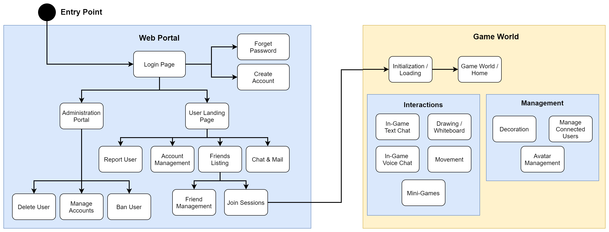
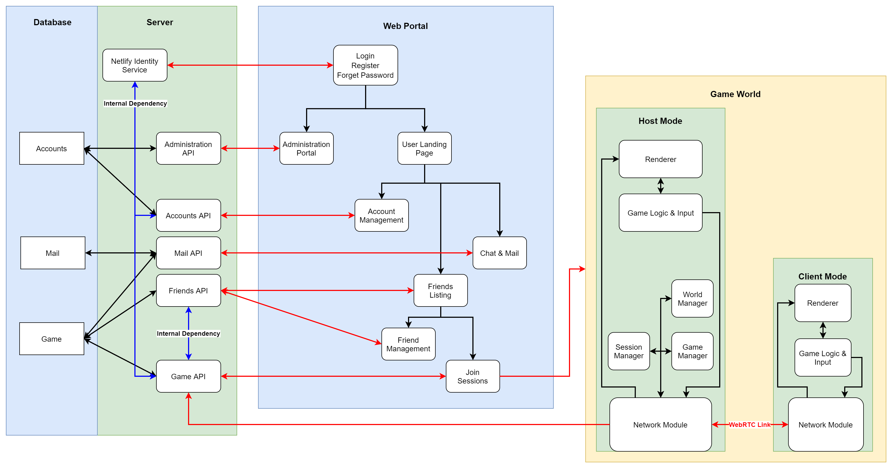

# Introduction
A virtual space for hanging out and doing fun things with your friends. Pekoland offers the perfect environment to discuss, talk, or simply chill with others online. It combines the functionality of chat applications like Discord with minigames to ensure that users always have something to do in Pekoland.

# Features
The features of Pekoland revolves around 2 primary aspects, user interaction and user enjoyment. It aims to achieve the following key functionalities:

* __User Interaction__
  * Movement in a virtual environment
  * Text chat
  * Voice chat
  * Shared drawings
* __User Enjoyment__
  * Minigames
  * World personalization

In addition to the primary functionality, management and administration utilities will also be included. All the features and user interaction flow can be summarised in the following image.

# System Design
The main design consideration is to reduce the traffic on the server as much as possible. This means that content that are network-intensive in nature (Game Updates, Voice Data) are offloaded to the clients, using Peer-To-Peer networking to achieve inter-client communication. This is to be implemented using the WebRTC protocol, using the [PeerJS](https://peerjs.com/) library.

However, in view of the fact that updates still need to be sent to the server for storage in the database, the system will employ a Master-Slave architecture for the clients, with 1 distinct Master-client communicating with the server, and all other Slave-clients communicating solely with that single Master-client.

The high-level system design and network endpoints are summarised in the following diagram.

# Technologies
The following are the planned technologies that will be used to implement the various parts of the system.

Server                                        | Web Client | Game Client
----------------------------------------------|------------|-------------
[AWS Lambda](https://aws.amazon.com/lambda/)  | [ReactJS](https://reactjs.org/) | [HTML5 Canvas](https://developer.mozilla.org/en-US/docs/Web/API/Canvas_API)
[Fauna DB](https://fauna.com/)                | HTML/CSS/Javascript             | [HTML5 Media](https://developer.mozilla.org/en-US/docs/Web/API/Media_Streams_API)
[Netlify Identity](https://docs.netlify.com/visitor-access/identity/) | &nbsp; | [WebRTC](https://webrtc.org/)
&nbsp; | &nbsp; | [PeerJS](https://peerjs.com/)
